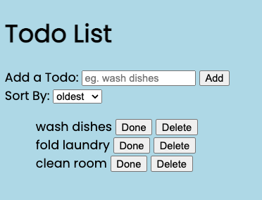
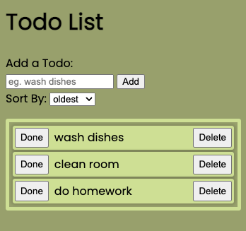

# [Todo List](https://2dl.netlify.app/)

# Description

A simple todo-list!

# Ideas:

- add sort-by dropdown. options: (oldest first, newest first, custom)
- edit text content of todo
- display how long ago todo item was created
- drag to reorder
- change done-button to checkbox button
- add bootstrap
- use event listeners on each button instead of just one event listener for the whole todo-list
- clear all button
- shift + click to select multiple todos
- show sort-by preference in url
- create toggle button to show/hide sort-by option
- add todo below/above any todo
- nest todos under other todos
- when todo list is empty, address todo list border
- adds done/create/delete animation to todo-items
- use icons buttons instead of text buttons
- make a secondary todo-list (for less urgent items)

# Evolution

Changed color theme.  
Adds a clear border around each todo-item.

Removed unecessary feature: Sort by newest/oldest.  
Expanded todo-input.
