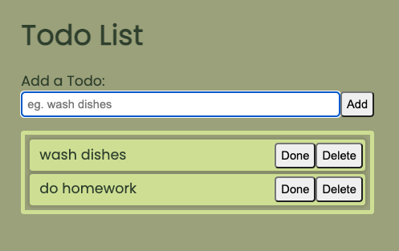

# [Todo List](https://2dl.netlify.app/)


# Description

A simple todo-list!
Uses local storage to remember todos after refreshing the page!

# Cleaner Code

I hear that developers who copy and paste code are probably doing something wrong.
In the example below, I refactored a block of repetitive code using a loop.
This reduced a lot of clutter, making it really easy to pinpoint key information and understand the code's purpose.

## Before Refactor:

```
  const doneTodoBtns = document.body.querySelectorAll(".done-todo-btn");
  doneTodoBtns.forEach((btn) => btn.addEventListener("click", toggleDoneTodo));

  const deleteTodoBtns = document.body.querySelectorAll(".delete-todo-btn");
  deleteTodoBtns.forEach((btn) => btn.addEventListener("click", deleteTodo));

  const todoTextEls = document.body.querySelectorAll(".todo-text");
  todoTextEls.forEach((todoTextEl) =>todoTextEl.addEventListener("input", saveTodoText));
```

## After Refactor:

```
  const selectorsEventsCallbacks = [
    {
      selector: ".done-todo-btn",
      eventType: "click",
      callback: toggleDoneTodo
    },
    {
      selector: ".delete-todo-btn",
      eventType: "click",
      callback: deleteTodo
    },
    {
      selector: ".todo-text",
      eventType: "input",
      callback: saveTodoText
    }
  ];

  selectorsEventsCallbacks.forEach(({ selector, eventType, callback }) => {
    const elements = document.body.querySelectorAll(selector);
    elements.forEach((element) => element.addEventListener(eventType, callback));
  });
```

# Ideas:

- make .done style more obvious. Cross the text out with a thick line.
- remove redundant click event listener for moving todos on mobile devices
- be able to re order todos with middle mouse click-and-drag
- use icons buttons instead of text buttons
- add animations to add todo, delete todo, move todo
- hide move-todo btn if there is only one todo
- when move-todo btn is clicked show alert: You can click-and-drag this before or after other todos.
- add sort-by dropdown. options: (oldest first, newest first, custom)
- edit text content of todo
- display how long ago todo item was created
- drag to reorder
- change done-button to checkbox button
- add bootstrap
- use event listeners on each button instead of just one event listener for the whole todo-list
- clear all button
- shift + click to select multiple todos
- show sort-by preference in url
- create toggle button to show/hide sort-by option
- add todo below/above any todo
- nest todos under other todos
- when todo list is empty, address todo list border
- adds done/create/delete animation to todo-items
- while clicking-and-dragging to move a todo, draw line from todo-to-move to new position
- make a secondary todo-list (for less urgent items)

# Evolution


Adds clear borders around each todo-item.
Changes color theme.



Removes unecessary feature: Sort by newest/oldest.  
Expands todo-input.


Adds click-and-drag and just-click reorder functionality.
Adds contrast and simplicity to style.
